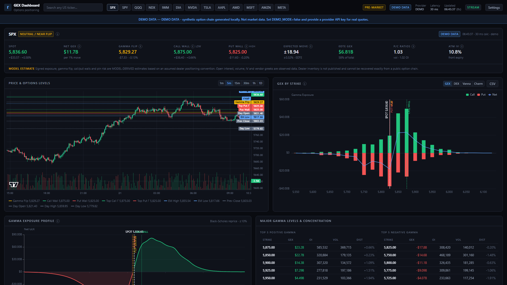

# GEX Trading Dashboard

A full-stack options positioning dashboard: gamma exposure, dealer positioning estimates,
greeks-derived exposures (DEX / Vanna / Charm), open interest, volume, 0DTE analytics,
implied volatility surfaces and options flow — for US equity and index options.

It is a real application, not a mockup. It connects to live market data providers, computes
every analytic itself, and refuses to present modelled numbers as exchange facts.



<sub>Light theme: [docs/screenshot-light.png](docs/screenshot-light.png)</sub>

---

## The one thing to read before trusting a number

Dealer inventory **is not published**. It cannot be recovered exactly from a public option chain.
Everything in this app is therefore tagged as one of two kinds:

| Kind | Examples | Meaning |
|---|---|---|
| **Observed** | Open interest, volume, bid/ask, implied volatility, vendor greeks, trades | Reported by the exchange or the data provider |
| **Model-derived** | Signed GEX, Net GEX, Gamma Flip, Call Wall, Put Wall, Pin Risk, DEX, Vanna, Charm | Computed by this application under an explicit, configurable assumption |

The UI shows this distinction on every tooltip and in the header disclaimer. The API returns a
`DataOrigin` field for the same reason. Do not read a model-derived level as a fact about
dealer books.

---

## Architecture

```
d:\Gex
├── backend/                     FastAPI · Python 3.12
│   ├── app/
│   │   ├── models.py            Normalized schema — the contract between all layers
│   │   ├── core/config.py       Env-driven settings (all secrets server-side)
│   │   ├── providers/           MarketDataProvider adapters
│   │   │   ├── base.py          ABC + retry, backoff, circuit breaker, dedup
│   │   │   ├── massive.py       Primary provider (Polygon.io API, REST + WebSocket)
│   │   │   ├── tradier.py       Fallback provider
│   │   │   ├── orats.py         Optional IV analytics
│   │   │   ├── demo.py          Synthetic data, always labelled DEMO
│   │   │   └── registry.py      Provider selection
│   │   ├── quant/               Calculation engine (no HTTP, no vendor types)
│   │   │   ├── black_scholes.py Vectorized BSM pricing and greeks
│   │   │   ├── gex_engine.py    GEX/DEX/Vanna/Charm, aggregation, gamma profile
│   │   │   ├── levels.py        Call wall, put wall, pin risk, regime
│   │   │   ├── volatility.py    ATM IV, skew, term structure, expected move
│   │   │   ├── quality.py       Data-quality gate
│   │   │   └── flow.py          Trade aggressor classification
│   │   ├── services/            Orchestration
│   │   │   ├── analytics.py     provider → quality → engine → levels pipeline
│   │   │   ├── cache.py         Redis with in-process fallback, single-flight
│   │   │   ├── history.py       Intraday GEX snapshots + prior-day OI (SQLite)
│   │   │   └── alerts.py        In-app alert rule engine
│   │   ├── api/routes/          REST + WebSocket
│   │   └── db/schema.sql        PostgreSQL schema
│   └── tests/                   161 tests
└── frontend/                    Next.js 16 · TypeScript strict · Tailwind
    ├── app/                     App router, theme bootstrap
    ├── components/              Panels + charts (ECharts, lightweight-charts)
    └── lib/                     Typed API client, formatters, glossary, hooks
```

**The load-bearing rule:** a provider adapter converts a vendor payload into
`app/models.py` types and nothing downstream ever sees vendor shapes. The quant engine takes
normalized contracts and returns numbers. Swapping `DATA_PROVIDER` changes nothing outside
`app/providers/`.

---

## Quick start

### 1. Backend

```bash
cd backend
python -m venv .venv
.venv\Scripts\python.exe -m pip install -r requirements-dev.txt   # Windows
# source .venv/bin/activate && pip install -r requirements-dev.txt  # macOS / Linux

# from the repo root
cp .env.example .env

.venv\Scripts\python.exe -m uvicorn app.main:app --reload --port 8000
```

API docs: <http://localhost:8000/docs>

### 2. Frontend

```bash
cd frontend
npm install
cp .env.local.example .env.local
npm run dev
```

Dashboard: <http://localhost:3000>

With no API keys set, the app starts in **Demo Mode** and displays a persistent `DEMO DATA`
banner. Demo data is synthetic and is never labelled LIVE.

---

## Environment variables

All keys are read by the **backend only**. The browser never receives a provider credential;
its only configuration value is the URL of this app's own API.

| Variable | Default | Purpose |
|---|---|---|
| `DATA_PROVIDER` | `demo` | `massive` \| `tradier` \| `demo` |
| `FALLBACK_PROVIDER` | `tradier` | Used when the primary has no credentials |
| `MASSIVE_API_KEY` | — | Primary provider key |
| `MASSIVE_BASE_URL` | `https://api.massive.com` | REST base (`api.polygon.io` also works) |
| `MASSIVE_WS_URL` | `wss://socket.massive.com` | WebSocket base |
| `MASSIVE_REALTIME` | `false` | Set `true` **only** on a plan with real-time options; otherwise data is reported as 15-minute delayed |
| `TRADIER_API_KEY` | — | Fallback provider key |
| `TRADIER_BASE_URL` | `https://api.tradier.com/v1` | Use the sandbox URL for sandbox tokens |
| `ORATS_API_KEY` | — | Optional: IV rank, percentile, historical IV |
| `DATABASE_URL` | — | Optional PostgreSQL; SQLite is used when unset |
| `REDIS_URL` | — | Optional; in-process cache is used when unset |
| `DEMO_MODE` | `true` | Force synthetic data |
| `CORS_ORIGINS` | `http://localhost:3000,http://127.0.0.1:3000` | Allowed browser origins |
| `CACHE_TTL_CHAIN` | `45` | Option chain cache seconds |
| `CACHE_TTL_UNDERLYING` | `5` | Underlying quote cache seconds |
| `GEX_SIGN_CONVENTION` | `calls_positive_puts_negative` | Default dealer assumption |
| `CONTRACT_MULTIPLIER_DEFAULT` | `100` | Only used when the provider omits it |
| `RISK_FREE_RATE` | `0.043` | Used for local greek computation |

**You need to supply:** `MASSIVE_API_KEY` (or `TRADIER_API_KEY`) to leave demo mode.
Everything else has a working default. `ORATS_API_KEY`, `DATABASE_URL` and `REDIS_URL` are
genuinely optional — the app runs fully without them.

`.env` and `.env.local` are gitignored. Only `.env.example` is committed.

---

## How GEX is calculated

### Per contract

```
GEX = gamma × open_interest × contract_multiplier × spot² × 0.01
```

`spot² × 0.01` expresses the result as dollars of hedging flow per **1% move** in the
underlying, which is the market convention. The multiplier comes from the provider when it
reports one; `CONTRACT_MULTIPLIER_DEFAULT` is only a fallback.

### Sign convention

Public data does not reveal who is long or short. The default assumption is that dealers are
short calls and long puts against customer flow, so call gamma is positive and put gamma
negative. Three conventions ship, selectable per request or in Settings:

| Convention | Calls | Puts |
|---|---|---|
| `calls_positive_puts_negative` (default) | + | − |
| `all_positive` | + | + |
| `put_positive_call_negative` | − | + |

Changing this inverts the interpretation of every exposure figure. It is an assumption, not a
measurement.

### Gamma profile and gamma flip

Rather than reading the flip off the current chain, the engine **reprices every contract**:
for each hypothetical spot in a ±10% band it recomputes gamma with Black-Scholes, re-aggregates
net GEX, and finds where the profile crosses zero. The crossing is **linearly interpolated**
between the two bracketing samples — snapping to the nearest grid point would quantise the flip
to tens of index points on SPX.

Contracts with no implied volatility are excluded from the profile: repricing them would mean
inventing a volatility.

### Call wall and put wall

Not simply "the biggest open interest". Each candidate strike on the correct side of spot is
scored:

```
score = (0.55 × normalised gamma + 0.25 × normalised OI)
        × (0.20 + 0.80 × gaussian proximity to spot)
        × (1 + 0.35 × normalised 0DTE gamma at that strike)
```

The proximity term stops leftover far-OTM open interest from outranking a strike actually in
play. The 0DTE term is capped at +35%, so same-day concentration decides between near-equal
candidates rather than overriding a large distance gap. Each wall reports a **confidence**
(high / medium / low) derived from how far it stands out from the runner-up.

### Other exposures

| Metric | Formula | Units |
|---|---|---|
| DEX | `delta × OI × multiplier × spot` | dollars of directional exposure |
| Vanna | `vanna × OI × multiplier × spot × 0.01` | per 1 vol point of IV |
| Charm | `charm × OI × multiplier × spot / 365` | per calendar day of decay |
| VGEX proxy | `gamma × volume × multiplier × spot² × 0.01` | **activity**, not inventory |

Vanna and charm are always computed locally — no mainstream chain API supplies them.
VGEX is deliberately named separately from GEX so it is never mistaken for a positioning figure.

### Expected move

The ATM straddle: mid price of the call plus the put at the strike nearest spot **with both
legs quoted**. Requiring both legs matters — a one-sided strike would silently halve the move.
When only one leg is quoted the app doubles it and says so in the `method` field.

---

## Assumptions and limitations

- **Dealer inventory is assumed, not known.** See the sign-convention section.
- **Open interest is not real-time.** It is published once per session. Intraday GEX uses the
  latest available OI with live spot, gamma and IV; the API and UI both state the OI timestamp.
- **OI changes carry no direction.** A delta in open interest cannot distinguish opening from
  closing trades, and the app never claims otherwise.
- **Flow aggressor tags describe print location only.** At-ask does not mean bullish, and a
  call is not a bullish trade — it may be a covered-call unwind or a hedge leg.
- **Pin risk is a heuristic score, not a probability** and not a forecast.
- **Market status ignores exchange holidays.** Sessions are computed from the clock only.
- **IV rank and percentile require history** this app does not keep. Set `ORATS_API_KEY` for them.
- **American-style early exercise is not modelled.** Greeks use Black-Scholes-Merton, which is
  European. For index options (SPX, NDX) this is correct; for single-name American options
  deep-ITM greeks will differ slightly from a binomial model.
- **Demo data is synthetic.** It exercises the same code paths but is not market data.

---

## API

Base path `/api`. Every GEX endpoint accepts the shared chain filters:
`max_dte`, `min_dte`, `expirations`, `strike_band_pct`, `include_0dte`, `convention`, `provider`.

| Endpoint | Returns |
|---|---|
| `GET /health` | Service status and active provider |
| `GET /api/config` | Non-secret runtime config for the UI |
| `GET /api/providers` | Provider health, entitlements, demo banner |
| `GET /api/symbols` · `/api/symbols/search?q=` | Symbol list and search |
| `GET /api/market/status` | Pre-market / open / after-hours / closed |
| `GET /api/market/{symbol}` | Underlying quote |
| `GET /api/market/{symbol}/bars?interval=` | OHLCV (`1m 5m 15m 30m 1h 1D`) |
| `GET /api/market/{symbol}/expirations` | Available expirations |
| `GET /api/gex/{symbol}` | **Full snapshot**: totals, 0DTE, all levels, regime, ratios, expected move |
| `GET /api/gex/{symbol}/by-strike` | Per-strike GEX/DEX/Vanna/Charm/OI/volume |
| `GET /api/gex/{symbol}/by-expiry` | Per-expiry exposure plus DTE buckets |
| `GET /api/gex/{symbol}/profile` | Gamma profile across hypothetical spots |
| `GET /api/gex/{symbol}/levels` | Top gamma strikes, concentration bands, pin risk |
| `GET /api/gex/{symbol}/0dte` | Same-session panel |
| `GET /api/gex/{symbol}/heatmap` | Strike × expiration matrix |
| `GET /api/gex/{symbol}/concentration` | Gamma concentration bands |
| `GET /api/options/{symbol}/chain` | Normalized chain with quality report |
| `GET /api/options/{symbol}/oi` | OI totals, by strike/expiry, day-over-day change |
| `GET /api/options/{symbol}/volume` | Volume totals and unusual activity |
| `GET /api/options/{symbol}/ratios` | Put/call ratios (all, 0DTE, per expiry) |
| `GET /api/options/{symbol}/iv` | ATM IV, skew, term structure, 25Δ risk reversal |
| `GET /api/options/{symbol}/expected-move` | Straddle expected move + presets |
| `GET /api/options/{symbol}/flow` | Classified trades with premium filters |
| `GET /api/options/{symbol}/export?dataset=` | CSV export |
| `GET /api/history/{symbol}/gex` | Intraday GEX series |
| `GET /api/watchlist?symbols=` | Multi-symbol roll-up |
| `GET/POST/DELETE /api/alerts` | In-app alert rules |
| `WS /ws/{symbol}` | Push: `underlying`, `gex`, `alerts`, `error` |

### Failure behaviour

When a provider fails the API returns `502` (or `429` for rate limits) with the provider name
and message. It **never** substitutes demo or stale data for a failed live request. The UI shows
a provider-unavailable panel with the last successful update time and a retry button.

---

## Data freshness

Every panel knows the provenance of its own data and displays one of:

`LIVE` · `DELAYED 15M` · `EOD` · `PREV DAY OI` · `STALE` · `DEMO DATA` · `UNKNOWN`

`LIVE` is shown only when the provider's own entitlement confirms it. Tradier market-data
tokens are treated as 15-minute delayed. Demo data is always `DEMO`.

---

## Performance

- Option chains are aggregated **server-side**; the UI receives per-strike rows and matrices,
  never thousands of raw contracts.
- All greek maths is vectorized over NumPy arrays.
- Chains are cached for `CACHE_TTL_CHAIN` seconds with **single-flight** deduplication, so
  concurrent panel loads produce one upstream call.
- One WebSocket producer per symbol serves every connected browser.
- Requests retry with exponential backoff, honour `Retry-After`, and trip a circuit breaker
  after repeated failures.
- Typical full-snapshot calculation on a ~1,600-contract chain: **20–30 ms**.

---

## Testing

```bash
cd backend
.venv\Scripts\python.exe -m pytest -q          # 161 tests
.venv\Scripts\python.exe -m ruff check .       # lint
.venv\Scripts\python.exe -m mypy app           # types

cd ../frontend
npm run type-check
npm run lint
npm run build
```

The quant tests include a **synthetic four-contract chain with round numbers** whose expected
aggregates are worked out by hand in `tests/conftest.py`, so engine output is checked against
arithmetic rather than against itself. Black-Scholes greeks are cross-checked by finite
difference and by put-call parity. Documented tolerances: `1e-6` absolute for exposures,
`1e-4` for finite-difference greek comparisons.

Edge cases covered: missing gamma, missing IV, zero and negative OI, zero volume, deep ITM and
OTM, zero DTE, empty chains, duplicate contracts, crossed quotes, stale timestamps, mismatched
underlyings and absent multipliers.

---

## Database

SQLite is used out of the box (`backend/data/gex_history.db`) for intraday GEX snapshots and
prior-session open interest — no setup needed. For a persistent deployment, apply the
PostgreSQL schema and set `DATABASE_URL`:

```bash
psql "$DATABASE_URL" -f backend/app/db/schema.sql
```

Tables: `symbols`, `underlying_snapshots`, `option_chain_snapshots`, `option_contract_snapshots`,
`gex_snapshots`, `gex_levels`, `historical_oi`, `flow_trades`, `alerts`, `alert_events`,
`provider_status`. Every row carries a timestamp.

---

## Deployment

- **Backend:** any ASGI host. `uvicorn app.main:app --host 0.0.0.0 --port 8000 --workers 4`.
  Set `CORS_ORIGINS` to the deployed frontend origin. Provide `REDIS_URL` so the cache is
  shared across workers.
- **Frontend:** `npm run build && npm start`, or any Next.js host. Set `NEXT_PUBLIC_API_BASE`
  to the public backend URL.
- Never expose provider keys to the browser, and never commit `.env`.

---

## Choosing a data provider

**Massive** is Polygon.io under its current name (rebranded October 2025); `api.polygon.io`
and `api.massive.com` serve the same API, and an existing Polygon key works unchanged.

Two vendor details the adapter handles, and that any integration must:

- **Index options need an `I:` ticker.** SPX is `I:SPX`, and indices use a different
  snapshot endpoint from equities. Plain `SPX` returns nothing.
- **The chain snapshot caps at 250 contracts per page** and paginates with `next_url`.
  Reading only page one silently truncates the chain and understates every exposure figure.

`MASSIVE_REALTIME` is a declaration, not a probe: the API does not flag whether a response
is delayed, so the app reports `DELAYED 15M` until you state otherwise. Setting it `true`
on a delayed plan would label 15-minute data as `LIVE`, which is the one thing this app is
built not to do.

---

## Adding a provider

1. Subclass `MarketDataProvider` in `backend/app/providers/`.
2. Implement `get_underlying`, `get_expirations`, `get_option_chain`; optionally
   `get_option_trades`, `get_historical_bars`, `search_symbols`, `stream_*`.
3. Return `app/models.py` types only, with an honest `delay_status`.
4. Register it in `providers/registry.py`.

Nothing else in the codebase changes.

---

## Note on the previous contents of this directory

The directory previously held an unrelated static HTML mockup (`index.html`, `script.js`,
`styles.css`). Those files were moved to `legacy/` rather than deleted; nothing in the
application references them, and the folder can be removed whenever you like.

---

## Legal

This project computes its analytics from licensed provider data. It does not scrape or
reproduce any third-party vendor's proprietary calculations. Nothing here is investment advice.
